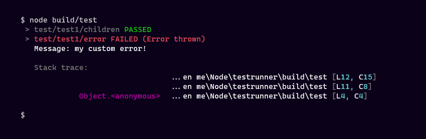

# testrunner
_Test runner for Node_



## Usage
```ts
import { caseOf } from ".";

caseOf("test1", (assert) => {
    let foo = "bar";
    assert(foo, "bar");

    caseOf("children", (assert) => {
        let msg = "Nested test case";
        assert(msg, msg);
    });

    caseOf("error", () => {
        throw new Error("my custom error!");
    });
});
```

### ``testrunner.caseOf(name: string, testCase: TestCase)``
Create new case and run it. Can run ``caseOf`` inside ``caseOf`` (or nested cases):
```ts
caseOf("caseName", (assert, fail) => {
    // code here
    // assert(va: any, vb: any): Compare 2 values
    // fail(reason?: any): Throw error and exit
});
```

### ``testrunner.initTestRunner(name: string)``
Create new ``TestRunner`` and return. It also make ``testrunner.caseOf`` to use this ``TestRunner`` as well
```ts
initTestRunner("myTest");
caseOf("case1", () => {
    // code here
});
```

### ``new testrunner.TestRunner(name: string)``
Create new ``TestRunner``
```ts
let runner = new TestRunner("myTest");
runner.caseOf("case", () => {
    // code here
});
```